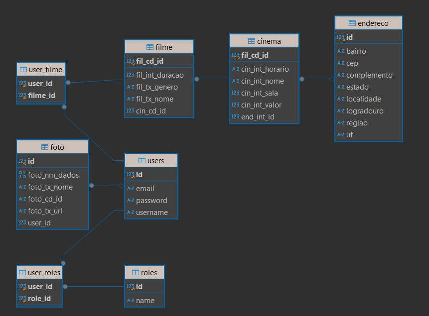

# ImperialFlix

ImperialFlix é uma API RESTful desenvolvida em Spring Boot, projetada para gerenciar cinemas, filmes e usuários com autenticação e autorização baseadas em JWT. 
Este projeto inclui operações CRUD completas para a entidade Cinema e operações em filmes, além de um sistema de envio de email, documentação com Swagger, e segurança JWT.

## Índice
1. [Recursos](#recursos)
2. [Arquitetura do Projeto](#arquitetura-do-projeto)
3. [Configurações e Dependências](#configurações-e-dependências)
4. [Como Executar](#como-executar)
5. [Endpoints](#endpoints)
6. [Diagrama ER](#diagrama-er)
7. [Exemplos de Requisições](#exemplos-de-requisições)

## Recursos

- **CRUD Completo** para Cinema com opções de gerenciamento de filmes
- **Autenticação JWT** para proteção de rotas
- **Autorização baseada em papéis** (`USER` e `ADMIN`)
- **Documentação da API com Swagger**
- **Envio de Emails** com suporte para mensagens HTML e anexos
- **Configuração CORS** permitindo origens configuráveis
- **Logging e Monitoramento** com configurações detalhadas de logs

## Arquitetura do Projeto

A estrutura do projeto segue uma organização modular com os seguintes pacotes principais:

- **config**: Configurações da aplicação, incluindo Swagger.
- **controllers**: Controladores para cada entidade, responsável por processar requisições HTTP.
- **dto**: Objetos de transferência de dados (Data Transfer Objects).
- **entities**: Classes de entidades e mapeamento ORM para banco de dados.
- **repositories**: Interfaces JPA para comunicação com o banco de dados.
- **security**: Configurações e classes de segurança JWT e autenticação.
- **services**: Classes de serviços com lógica de negócio.
- **utils**: Utilitários, incluindo uma integração de busca de endereço por CEP.

## Configurações e Dependências

- **Java 17**
- **Spring Boot 2.7**
- **Banco de Dados**: PostgreSQL
- **Segurança JWT**: Dependências Spring Security e JWT.
- **Swagger** para documentação
- **Mail Sender** para envio de emails

As principais dependências estão configuradas no `pom.xml` (para Maven) ou `build.gradle` (para Gradle).

## Como Executar

### Pré-requisitos

1. **Instalar Java 17**.
2. **Configurar o PostgreSQL**:
   - Crie um banco de dados chamado `imperialflix`.
   - Atualize as configurações de `application.properties` com as credenciais do banco.

3. **Configurar Variáveis de Ambiente**:
   - No arquivo `application.properties`, preencha as configurações de email e JWT.

## Endpoints
### Autenticação e Autorização
- /auth/login (POST): Autentica o usuário e retorna um token JWT.
- /auth/signup (POST): Registra um novo usuário.
### Endpoints de Cinema
- /cinema (GET): Lista todos os cinemas.
- /cinema/{id} (GET): Obtém um cinema pelo ID.
- /cinema (POST): Cria um novo cinema.
- /cinema/{id} (PUT): Atualiza um cinema existente.
- /cinema/{id} (DELETE): Deleta um cinema pelo ID.
### Endpoints de Filme
- /filmes (GET): Lista todos os filmes.
- /filmes/{id} (GET): Obtém um filme pelo ID.
- /filmes (POST): Cria um novo filme.
- /filmes/{id} (PUT): Atualiza um filme existente.
- /filmes/{id} (DELETE): Deleta um filme pelo ID.
### Endpoints de Endereço
- /endereco (GET): Lista todos os endereços.
- /endereco/{id} (GET): Obtém um endereço pelo ID.
- /endereco (POST): Cria um novo endereço.
- /endereco/{id} (PUT): Atualiza um endereço existente.
- /endereco/{id} (DELETE): Deleta um endereço pelo ID.
### Endpoints de Email
- /filme/envioemail (GET): Envia um email de teste em HTML com anexo.
## Diagrama ER

O diagrama ER abaixo detalha as relações principais entre as entidades:

Cinema possui uma relação @OneToOne com Endereco, significando que cada cinema possui um único endereço associado.  
Cinema possui uma relação @OneToMany com Filme, indicando que um cinema pode ter vários filmes em exibição.  
User possui relações @ManyToMany com Role e Filme.

## Exemplos de Requisições
### Autenticação (Login)
POST /auth/login
Content-Type: application/json  
{  
  "username": "user123",  
  "password": "senhaSegura"  
}

### Resposta:
{
  "token": "eyJhbGciOiJIUzUxMiJ9...",  
  "type": "Bearer",  
  "id": 1,  
  "username": "user123",  
  "email": "user@example.com",  
  "roles": ["ROLE_USER"]  
}

### Criação de Cinema
POST /cinema
Content-Type: application/json
Authorization: Bearer {token}

{
  "nome": "Cinema Imperial",  
  "sala": 5,  
  "valor": 25.50,  
  "horario": "14:00",  
  "endereco": {  
    "id": 1,  
    "cep": "12345678",  
    "logradouro": "Av. das Flores",  
    "bairro": "Centro",  
    "localidade": "Imperial",  
    "uf": "SP"  
  },  
  "filmesIds": [1, 2]  
}
### Resposta:
{
  "id": 3,  
  "nome": "Cinema Imperial",  
  "sala": 5,  
  "valor": 25.50,  
  "horario": "14:00",  
  "endereco": {  
    "id": 1,  
    "cep": "12345678",  
    "logradouro": "Av. das Flores",  
    "bairro": "Centro",  
    "localidade": "Imperial",  
    "uf": "SP"  
  },  
  "filmes": [  
    {  
      "id": 1,  
      "nome": "Filme Exemplo",  
      "genero": "Aventura",  
      "duracao": 120  
    }  
  ]  
}  
### Criação de Endereço
POST /endereco  
Content-Type: application/json  
Authorization: Bearer {token}  

{  
  "cep": "12345678",  
  "logradouro": "Rua Exemplo",  
  "complemento": "Apto 101",  
  "bairro": "Bairro Exemplo",  
  "localidade": "Cidade Exemplo",  
  "uf": "SP",  
  "estado": "São Paulo",  
  "regiao": "Sudeste"  
}
### Resposta:
{  
  "id": 1,  
  "cep": "12345678",  
  "logradouro": "Rua Exemplo",  
  "complemento": "Apto 101",  
  "bairro": "Bairro Exemplo",  
  "localidade": "Cidade Exemplo",  
  "uf": "SP",  
  "estado": "São Paulo",  
  "regiao": "Sudeste"  
}

   
